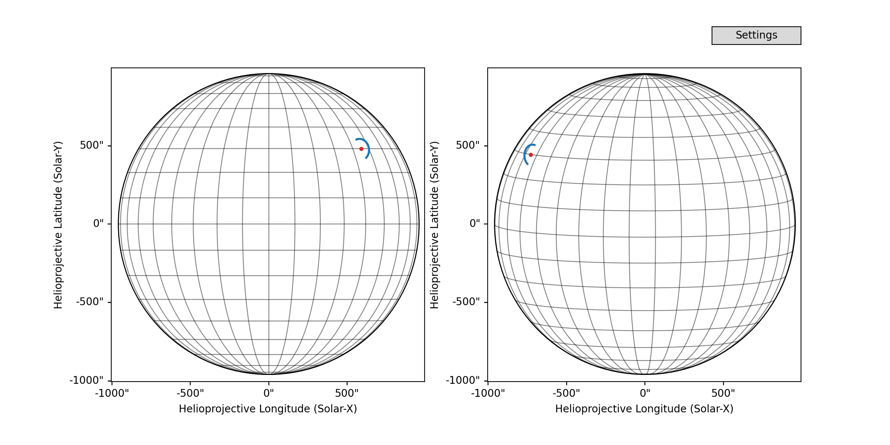

# CoronalLoopBuilder

CoronalLoopBuilder is a Python package designed to generate and visualize coronal loops on solar images viewed from different observers.

## Features

- **Interactive Visualization**: Use the `CoronalLoopBuilder` to interactively adjust parameters and customize the appearance of the coronal loops on solar images.
  
- **Support for Multiple Observers**: The tool can visualize loops from the perspective of multiple observers. For instance, if you provide a SDO/AIA map and a SoLO/STIX map, the code will visualize the loop from both viewing perspectives.
  
- **Dummy Maps for Demonstration**: The package comes with dummy solar images to demonstrate its functionality. However, these can be replaced with any real solar images observed from different instruments.

## Usage

1. **Installation**: Clone the repository and navigate to its directory. Then, install the required dependencies using:
    ```bash
    git clone https://github.com/sageyu123/CoronalLoopBuilder.git
    cd CoronalLoopBuilder
    pip install -r requirements.txt
    ```

2. **Running the Example**: Navigate to the `examples` directory and run the provided example to see the `CoronalLoopBuilder` in action.

3. **Integration with Solar Images**: Replace the dummy maps in the example with real solar images to visualize coronal loops on actual solar observations.
   

## Contributing

We welcome contributions from the community! Here's how you can contribute:

1. **Fork the Repository**: Click on the 'Fork' button at the top right corner of the repository page to create a copy of the repository in your GitHub account.

2. **Clone Your Fork**: Clone the forked repository to your local machine.

3. **Make Changes**: Implement your changes, enhancements, or bug fixes.

4. **Commit and Push**: Commit your changes and push them to your forked repository on GitHub.

5. **Create a Pull Request**: Navigate to the 'Pull Requests' tab of the original repository and click on 'New Pull Request'. Choose your fork and the branch containing your changes, then create the pull request.

Please ensure that your code adheres to our coding standards and includes appropriate tests and documentation.

## License

This project is licensed under the MIT License. See the `LICENSE` file for details.
